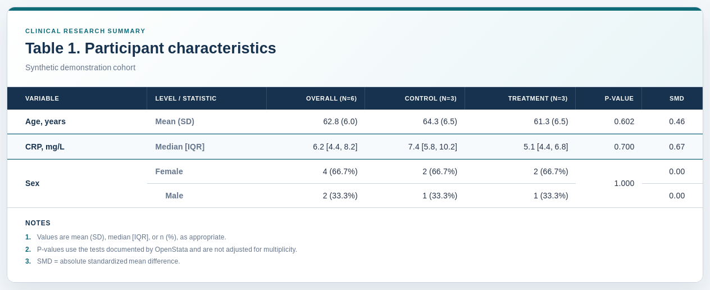

# OpenStata

OpenStata is a Python library for familiar, reproducible clinical-statistics workflows. It brings commonly used Stata-style operations to pandas, with a special focus on baseline characteristics tables and transparent statistical methods.

> Project status: early alpha. The current release is a tested foundation for descriptive analysis, not a complete Stata replacement.

## Example output

A publication-ready Table 1 exported by OpenStata from a synthetic demonstration cohort:



The same table can be exported as standalone HTML, formatted Excel, or editable Word.

## What works now

- `summarize`: observations, missing values, mean, standard deviation, range, detailed percentiles, variance, skewness, and kurtosis
- `ci mean`: Student's t confidence intervals for one or more means
- `ci proportion`: exact and approximate binomial confidence intervals for binary outcomes
- `tabulate`: one-way and two-way frequency tables with missing-value and percentage modes
- `table1`: grouped baseline characteristics tables for clinical studies
- Professional Table 1 export to standalone HTML, formatted Excel, and editable Word
- CSV, TSV, Stata `.dta`, and Parquet input and output
- Functional Python API, `OpenStata` wrapper, Stata-like command strings, and command-line interface
- Automated tests on Python 3.10, 3.11, and 3.12

Numeric summaries, confidence intervals, and continuous Table 1 statistics treat
`NaN` and positive or negative infinity as missing values.

## Installation

Clone the repository and install it in a virtual environment:

```bash
git clone https://github.com/wakuwakumiwaku/openstata.git
cd openstata
python -m venv .venv
source .venv/bin/activate
python -m pip install -e .
```

For development tools:

```bash
python -m pip install -e ".[dev]"
```

Parquet support uses an optional engine:

```bash
python -m pip install -e ".[parquet]"
```

Formatted Excel and Word export use optional dependencies. Standalone HTML export
works with the core installation.

```bash
python -m pip install -e ".[export]"
```

## Quick start

```python
import pandas as pd

from openstata import OpenStata, ci_mean, ci_proportion, table1

patients = pd.DataFrame(
    {
        "arm": ["Control", "Control", "Treatment", "Treatment"],
        "age": [64, 58, 61, 55],
        "crp": [4.2, 13.1, 3.8, 8.5],
        "female": [1, 0, 1, 1],
    }
)

stata = OpenStata(patients)

print(stata.run("summarize age crp, detail"))
print(ci_mean(patients, ["age", "crp"], level=95))
print(ci_proportion(patients, ["female"], method="wilson"))
print(stata.run("tabulate arm female, row"))

baseline = table1(
    patients,
    ["age", "crp", "female"],
    by="arm",
    categorical=["female"],
    nonnormal=["crp"],
    pvalues=True,
    standardized_differences=True,
)
print(baseline)
```

## Familiar command syntax

The command layer intentionally supports a small, explicit subset instead of pretending to parse all Stata syntax.

```python
stata.run("summarize age bmi, detail")
stata.run("ci means age bmi, level(90)")
stata.run("ci proportions female, wilson level(90)")
stata.run("tabulate treatment sex")
stata.run("tabulate treatment sex, row")
stata.run("table1 age bmi sex, by(treatment) categorical(sex) missing pvalues smd")
```

Aliases include `sum`, `tab`, and `baseline`.

## Confidence intervals for means

Use `ci_mean()` when an estimate and its uncertainty are more useful than a descriptive
summary alone:

```python
from openstata import ci_mean

intervals = ci_mean(data, ["systolic_bp", "ldl"], level=95)
```

The result contains the number of observations, mean, standard error, and lower and
upper confidence limits for each variable. Intervals use Student's t distribution with
`n - 1` degrees of freedom. Missing and non-finite values are excluded independently
for each variable; standard errors and intervals are undefined when fewer than two
observations remain. The confidence level is stored in
`intervals.attrs["confidence_level"]`.

## Confidence intervals for proportions

Binary outcomes coded as `0` and `1` can be summarized with exact or approximate
binomial confidence intervals:

```python
from openstata import ci_proportion

intervals = ci_proportion(data, ["readmitted", "adverse_event"], method="wilson")
```

The default `exact` method is the Clopper-Pearson interval. `wald`, `wilson`,
`agresti`, and `jeffreys` are also available. Missing and non-finite values are
excluded per variable. Calling `ci_proportion(data)` without a variable list selects
binary numeric and Boolean columns automatically. The confidence level and method are
stored in the result's `attrs` mapping.

## Baseline Table 1

```python
from openstata import table1

result = table1(
    data,
    variables=["age", "bmi", "crp", "sex", "smoking"],
    by="treatment",
    categorical=["sex", "smoking"],
    nonnormal=["crp"],
    labels={"bmi": "BMI, kg/m²", "crp": "CRP, mg/L"},
    include_missing=True,
    pvalues=True,
    standardized_differences=True,
    digits=1,
)
```

The initial implementation uses:

| Variable or comparison | Summary or test |
|---|---|
| Continuous | Mean (SD) |
| Continuous declared `nonnormal` | Median [IQR] |
| Categorical | n (%) |
| Two continuous groups | Welch's t test or Mann-Whitney U |
| More than two continuous groups | One-way ANOVA or Kruskal-Wallis |
| Categorical groups | Pearson chi-square |
| Sparse 2 by 2 categorical table | Fisher's exact test |
| Two groups | Absolute standardized mean difference |

P-values and standardized differences are optional. Missingness is displayed explicitly when requested. Group rows with missing values in the grouping variable are excluded from the analysis population.

## Professional export

Export the DataFrame returned by `table1()`:

```python
from openstata import export_table1

export_table1(
    result,
    "participant_characteristics.html",
    title="Table 1. Participant characteristics",
    subtitle="Randomized analysis population",
    style="clinical",
)
```

Or build and export in one call:

```python
stata.export_table1(
    "participant_characteristics.docx",
    ["age", "bmi", "crp", "sex", "smoking"],
    by="treatment",
    categorical=["sex", "smoking"],
    nonnormal=["crp"],
    pvalues=True,
    standardized_differences=True,
    title="Table 1. Participant characteristics",
    style="journal",
)
```

Supported formats and behavior:

| Extension | Output |
|---|---|
| `.html` | Standalone responsive table with embedded CSS and print styling |
| `.xlsx` | Formatted Excel workbook with frozen headers, merged variable groups, notes, and print setup |
| `.docx` | Editable landscape Word table with grouped variables, styled headers, and notes |

Three themes are available: `clinical`, `journal`, and `minimal`. Exported group
headings include analysis-population sample sizes automatically. Existing files are
protected unless `overwrite=True` is supplied. HTML can be printed to PDF from any
modern browser without adding a heavyweight PDF dependency.

## Reading Stata data

```python
from openstata import read_data, write_data

data = read_data("trial.dta")
write_data(data, "clean_trial.dta", version=118)
```

OpenStata uses pandas for `.dta` compatibility. Stata value labels are therefore handled according to `pandas.read_stata` options.

## Command-line use

```bash
openstata --version
openstata trial.dta "summarize age bmi, detail"
openstata trial.dta "ci means age bmi, level(90)" --format json
openstata trial.dta "ci proportions female, wilson level(90)" --format json
openstata trial.csv "table1 age bmi sex, by(arm) categorical(sex) pvalues smd" --format csv
openstata trial.dta "table1 age bmi sex, by(arm) categorical(sex) pvalues smd" \
  --output table1.html --title "Table 1. Participant characteristics" --style clinical
openstata trial.dta "baseline age bmi sex, by(arm) categorical(sex) pvalues smd" \
  --output table1.docx --style journal
```

Use `--subtitle`, repeatable `--footnote`, and `--overwrite` to customize export.

## Design principles

1. Clinical defaults must be visible and documented.
2. Results are returned as pandas DataFrames so they remain inspectable and exportable.
3. Command syntax is convenient, while the Python API remains the source of truth.
4. Every statistical feature needs deterministic tests against a small known dataset.
5. OpenStata should complement the scientific Python ecosystem rather than reimplement it.

## Roadmap

Near-term candidates include:

- linear, logistic, and count regression with Stata-like result tables
- Kaplan-Meier summaries and Cox proportional hazards models
- stratified and paired analyses
- variable labels and richer `.dta` metadata preservation
- LaTeX export and journal-specific table templates
- Stata-like `if` and `in` observation filters
- validation examples against documented Stata output

See [CONTRIBUTING.md](CONTRIBUTING.md) before proposing a new command.

## Development

```bash
ruff check .
pytest --cov=openstata --cov-report=term-missing
python -m build
```

## Scope and medical use

OpenStata is research software. It does not provide medical advice and must not be used as the sole basis for diagnosis, treatment, or regulatory decisions. Analysts remain responsible for checking assumptions, data quality, model choice, and reproduced output.

## License and trademark

Released under the MIT License.

OpenStata is an independent open-source project. It is not affiliated with or endorsed by StataCorp LLC. Stata is a registered trademark of StataCorp LLC.
